# ASTRO - Gaussian Plume Model library testing
This is a testing of Gaussian Plume Model library https://personalpages.manchester.ac.uk/staff/paul.connolly/teaching/practicals/gaussian_plume_modelling.html
## Running tests

Astro_model.py script updates gaussian_plume_model.py script to provide easier way of changing parameters. 


### import 


```python
from astro_model import *
```

### load default congifuration


```python
# Variables that can be changed by the user -------------------------------

RH=0.90;
aerosol_type=SODIUM_CHLORIDE;

dry_size=60e-9;
humidify=DRY_AEROSOL;

stab1=1; # set from 1-6
stability_used=CONSTANT_STABILITY;

output=PLAN_VIEW;
x_slice=26; # position (1-50) to take the slice in the x-direction
y_slice=1;  # position (1-50) to plot concentrations vs time

wind=PREVAILING_WIND;
stacks=ONE_STACK;
stack_x=[0., 1000., -200.];
stack_y=[0., 250., -500.];

Q=[40., 40., 40.]; # mass emitted per unit time
H=[50., 50., 50.]; # stack height, m
days=50;          # run the model for 365 days

#--------------------------------------------------------------------------

dxy=100;          # resolution of the model in both x and y directions
dz=10;
x=np.mgrid[-2500:2500+dxy:dxy]; # solve on a 5 km domain
y=x;              # x-grid is same as y-grid
times=np.mgrid[1:(days)*24+1:1]/24.;
Dy=10.;
Dz=10.;
```

### Values that can be used for properties

#### view (variable 'output')
PLAN_VIEW, HEIGHT_SLICE, SURFACE_TIME, NO_PLOT

#### wind field (variable 'wind')
PREVAILING_WIND, FLUCTUATING_WIND, CONSTANT_WIND

#### number of stacks (variable 'stacks')
THREE_STACKS, TWO_STACKS, ONE_STACK

# stability of the atmosphere (variable 'stability_used')
CONSTANT_STABILITY, ANNUAL_CYCLE

#### Aerosol properties (variable 'humidify')
DRY_AEROSOL, HUMIDIFY

#### Aerosol types (variable 'aerosol_type')
AMMONIUM_NITRATE, ORGANIC_ACID, SULPHURIC_ACID, SODIUM_CHLORIDE 

### function that runs the model with updated parameters


```python
def run():
    run_model(Dz, Dy, times, days, H, Q, stack_y, stack_x, stacks, wind, y_slice, x_slice, output, stability_used, stab1, humidify, dry_size, aerosol_type, RH, x, y, dz, dxy, Mw, Ms, nu, rho_s)

```

## Testing results


```python
# default values for parameters
run()
```

    100%|██████████| 1200/1200 [00:02<00:00, 559.89it/s]
    

    do not humidify
    


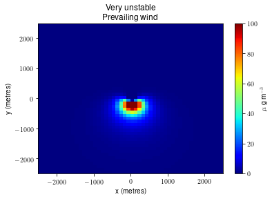


### changing number of stacks


```python
stacks = TWO_STACKS;
run()
```

    100%|██████████| 1200/1200 [00:04<00:00, 267.86it/s]
    

    do not humidify
    


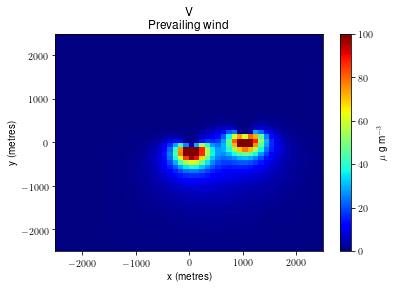


```python
stacks = THREE_STACKS;
run()
```

    100%|██████████| 1200/1200 [00:06<00:00, 188.86it/s]
    

    do not humidify
    


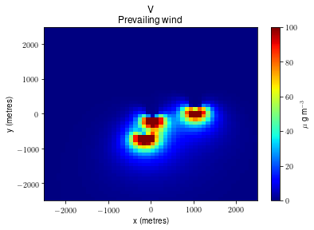


### Moving stacks


```python
# Move stack No. 2 (0-based indexing) from (-200, -500) to (-1500, -1500)
stack_x[2] = -1500
stack_y[2] = -1500
run()
```

    100%|██████████| 1200/1200 [00:06<00:00, 183.18it/s]
    

    do not humidify
    


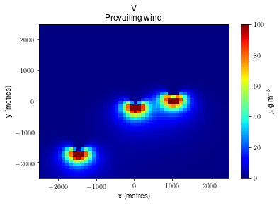


```python
def MoveStack(stackNo = 0, newX, newY):
    if stackNo > 2 or stackNo < 0:
        print("Invalid stack index. It should be from 0 to 2.")
        return
    maxY = dxy * Dy
    if newX > maxY or newX < 0 or newY > maxY or newY < 0 :
        print("Invalid value for Coordinate. It should be from 0 to " + maxY + ".")
        return
    stack_x[stackNo] = newX
    stack_y[stackNo] = newY
```

### changing view
values: PLAN_VIEW, HEIGHT_SLICE, SURFACE_TIME, NO_PLOT


```python
output = HEIGHT_SLICE
x_slice=30; # position (1-50) to take the slice in the x-direction
run()
```

    100%|██████████| 1200/1200 [00:06<00:00, 188.75it/s]
    

    do not humidify
    


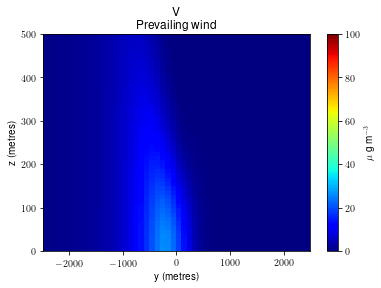


```python
output = SURFACE_TIME
y_slice=3;  # position (1-50) to plot concentrations vs time
run()
```

    100%|██████████| 1200/1200 [00:06<00:00, 188.21it/s]
    

    do not humidify
    

    C:\HOME\PLUMESIM\astro_model.py:263: UserWarning: Matplotlib is currently using module://ipykernel.pylab.backend_inline, which is a non-GUI backend, so cannot show the figure.
      f.show()
    findfont: Font family ['sans-serif'] not found. Falling back to DejaVu Sans.
    


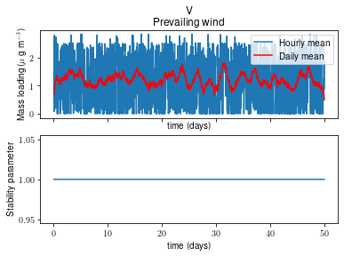


### changing wind field
PREVAILING_WIND, FLUCTUATING_WIND, CONSTANT_WIND


```python
wind = FLUCTUATING_WIND
run()
```

    100%|██████████| 1200/1200 [00:06<00:00, 178.70it/s]
    

    do not humidify
    


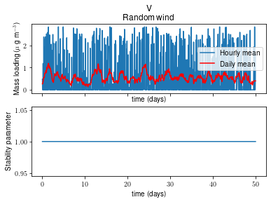


```python
output = PLAN_VIEW
run()
```

    100%|██████████| 1200/1200 [00:06<00:00, 180.84it/s]
    

    do not humidify
    


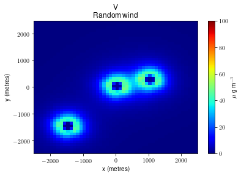


```python
wind = CONSTANT_WIND
run()
```

    100%|██████████| 1200/1200 [00:06<00:00, 189.66it/s]
    

    do not humidify
    


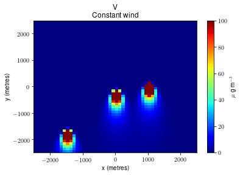


### changing stability of the atmosphere
CONSTANT_STABILITY, ANNUAL_CYCLE


```python
stability_used = ANNUAL_CYCLE
run()
```

    100%|██████████| 1200/1200 [00:06<00:00, 182.86it/s]
    

    do not humidify
    


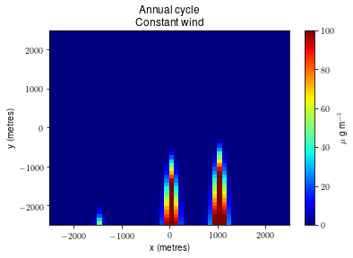


```python
stab1 = 4 # set from 1-6
run()
```

    100%|██████████| 1200/1200 [00:06<00:00, 180.61it/s]
    

    do not humidify
    


```python
stability_used = CONSTANT_STABILITY
run()
```

    100%|██████████| 1200/1200 [00:06<00:00, 195.82it/s]
    

    do not humidify
    


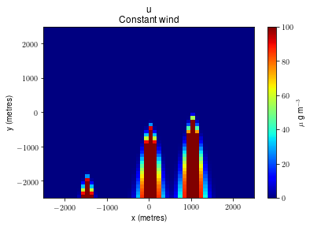


```python
stab1 = 1
```

### changing Aerosol properties
DRY_AEROSOL, HUMIDIFY


```python
humidify = HUMIDIFY
run()
```

    100%|██████████| 1200/1200 [00:06<00:00, 190.25it/s]
    


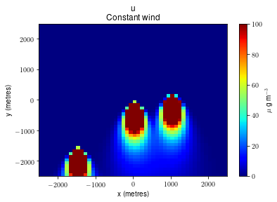


### changing Aerosol types 
AMMONIUM_NITRATE, ORGANIC_ACID, SULPHURIC_ACID, SODIUM_CHLORIDE

SODIUM_CHLORIDE is default (but after finding bug - seems it's SULPHURIC_ACID)


```python
aerosol_type = AMMONIUM_NITRATE
run()
```

    100%|██████████| 1200/1200 [00:06<00:00, 189.90it/s]
    


    ---------------------------------------------------------------------------

    IndexError                                Traceback (most recent call last)

    <ipython-input-18-07fe16b630e9> in <module>
          1 aerosol_type = AMMONIUM_NITRATE
    ----> 2 run()
    

    <ipython-input-3-42785e4f921c> in run()
          1 def run():
    ----> 2     run_model(Dz, Dy, times, days, H, Q, stack_y, stack_x, stacks, wind, y_slice, x_slice, output, stability_used, stab1, humidify, dry_size, aerosol_type, RH, x, y, dz, dxy, Mw, Ms, nu, rho_s)
    

    ~\PLUMESIM\astro_model.py in run_model(Dz, Dy, times, days, H, Q, stack_y, stack_x, stacks, wind, y_slice, x_slice, output, stability_used, stab1, humidify, dry_size, aerosol_type, RH, x, y, dz, dxy, Mw, Ms, nu, rho_s)
        205        print('do not humidify');
        206     elif humidify == HUMIDIFY:
    --> 207        mass=np.pi/6.*rho_s[aerosol_type]*dry_size**3.;
        208        moles=mass/Ms[aerosol_type];
        209 
    

    IndexError: list index out of range


```python
### bug found: Constants are 1-based and arrays rho_s, Ms etc. are 0-based in Python.
aerosol_type = AMMONIUM_NITRATE -1
run()
```

    100%|██████████| 1200/1200 [00:06<00:00, 188.69it/s]
    


```python
aerosol_type = ORGANIC_ACID -1
run()
```

    100%|██████████| 1200/1200 [00:06<00:00, 182.47it/s]
    


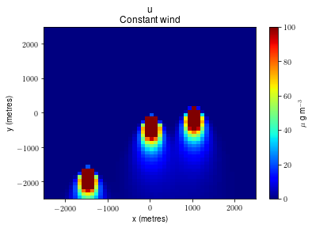


```python
aerosol_type = SULPHURIC_ACID -1
run()
```

    100%|██████████| 1200/1200 [00:06<00:00, 190.93it/s]
    


```python
aerosol_type = SODIUM_CHLORIDE -1
run()
```

    100%|██████████| 1200/1200 [00:06<00:00, 187.88it/s]
    


### changing stacks height and emmision


```python
Q=[40., 40., 50.]; # mass emitted per unit time
H=[50., 100., 50.]; # stack height, m
run()
```

    100%|██████████| 1200/1200 [00:06<00:00, 189.12it/s]
    


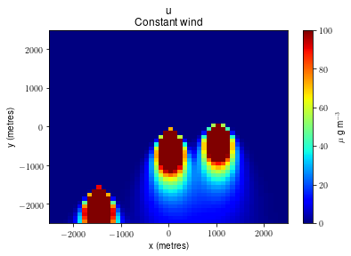


```python
def setStackProperty(stackNo = 0, massPerTime = 40., height = 50.):
    if stackNo > 2 or stackNo < 0:
        print("Invalid stack index. It should be from 0 to 2.")
        return
    Q[stackNo] = massPerTime
    H[stackNo] = height
```

### changing Relative humidity of the air
default is 0.90


```python
RH=0.70;
run()
```

    100%|██████████| 1200/1200 [00:06<00:00, 198.49it/s]
    


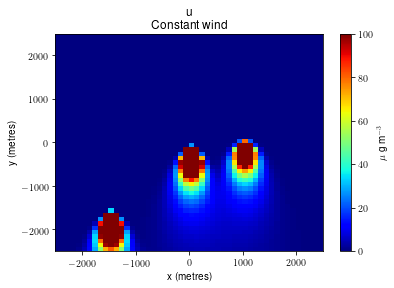


### changing model run-time in days


```python
days = 300
run()
```

    100%|██████████| 7200/7200 [00:38<00:00, 185.76it/s]
    


for 50 days period it took 6s to run the model and for period of 300 days it took 38s to run the model. It's linear complexity.
